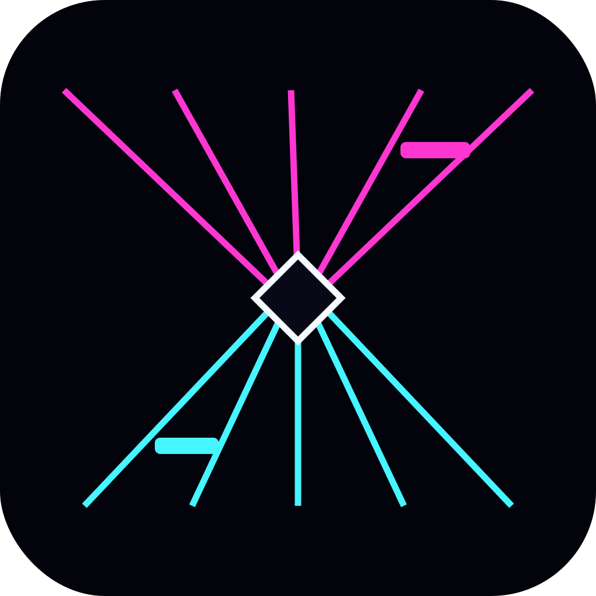

# VaporStep



**VaporStep turns your webcam into a full-body rhythm game.** Step, reach, stomp and pump your hands through the lanes as notes arrive with the music — no dance pad or motion controllers required.

VaporStep has out of the box support for StepMania style step/sim files, so you should be able to point it at your existing libraries and play.

<p float="left">
  
  
  
  
  
</p>


[▶ Gameplay demo](https://github.com/user-attachments/assets/f7e4009d-6738-4d5f-801c-370e0ecce669)

🎵 “Neutralize” by SiLiS — [CC BY-SA 4.0](https://creativecommons.org/licenses/by-sa/4.0/).


## What you can do

- Play using your whole body through an ordinary webcam.
- Use both **foot lanes and hand lanes**.
- Play supported StepMania-compatible `.sm` and `.ssc` song libraries.
- Calibrate the camera and reach to suit your room and camera.
- Browse songs by difficulty, BPM and hand/foot information.
- Favorite songs, filter previously played songs and keep local high scores.
- Record each run as a local shareable video with the rendered silhouette and game audio.
- Play on macOS, Windows and Linux.

VaporStep does **not** include songs or song-pack artwork. You provide your own compatible song library.

## Getting started

The easiest way to use VaporStep is with a packaged build from the project releases page:

[Download the latest release](../../releases/latest)

1. Download the build for your platform and launch VaporStep.
2. Put your compatible song library in `~/VaporStep/Songs`, or choose **Song Folder** to use another location.
3. Open **Calibration** if you want to check camera position or adjust reach.
4. Choose **Play**, pick a song and move into position.

On first launch your operating system may ask for camera access. VaporStep releases the camera whenever you are browsing menus or results and acquires it only for calibration and gameplay. If you later choose a song folder in an operating-system protected location, the OS may separately ask for permission to access it.

This app is not signed so you may have to jump through some hoops to launch it on MacOS and Windows.

## Song libraries

VaporStep currently supports selected StepMania-compatible `.sm` and `.ssc` charts, including `dance-single` and `ds3ddx-single` charts.

Need songs? Try out the awesome [OutFox Serenity](https://github.com/TeamRizu/OutFox-Serenity/releases/tag/v2.5) pack.

For details on chart compatibility, how VaporStep interprets holds/repeated steps, and notes for making compatible charts, see [Stepfiles and chart authoring](docs/STEPFILES.md).

StepMania, Dance Super Station and related names are referenced only to describe file/chart compatibility. VaporStep is an independent project and is not affiliated with or endorsed by those projects.

## Health & Safety

VaporStep is a physically active game involving stepping, reaching, twisting and rapid movement. Make sure you have a clear, stable play area with enough room to move safely. Wear appropriate footwear, play within your own abilities, and stop playing if you feel pain, dizziness, unusual shortness of breath, or otherwise feel unwell.

If you have a medical condition or concern about physical activity, seek appropriate medical advice before playing. Children should play with appropriate adult supervision. Physical activity carries an inherent risk of injury; you are responsible for choosing a safe play environment and level of activity.

## Privacy

Raw webcam frames are processed locally and are not saved or uploaded by VaporStep. The camera is used only during calibration and gameplay. If **Record Play** is enabled, VaporStep saves only the rendered game view — including your stylized silhouette — and reconstructed game audio to a local video file. VaporStep uses MediaPipe for on-device pose detection and tracking; camera/video input is processed on-device.

Song libraries and high scores remain local to your computer. See [SECURITY.md](SECURITY.md) for security reporting and additional implementation notes.

## Developers

To run from source:

```bash
python3.12 -m venv .venv
source .venv/bin/activate        # Windows: .venv\Scripts\activate
python -m pip install -e .
python -m vaporstep
```

Development setup, tests, packaging, model assets and CI are documented in [Developer guide](docs/DEVELOPMENT.md).

## License

VaporStep is released under the [MIT License](LICENSE). Bundled third-party components retain their own licenses; see [THIRD_PARTY_NOTICES.md](THIRD_PARTY_NOTICES.md) and [FFmpeg provenance](FFMPEG_PROVENANCE.md). The same safety, privacy and license summary is available from **About** inside the app.
